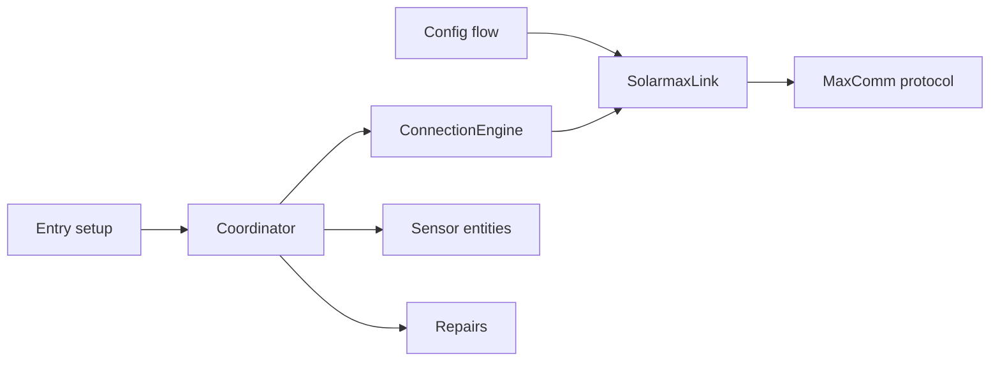

# Architecture

SolarMax separates protocol parsing, socket ownership, connection policy, Home Assistant scheduling, and entity presentation. Keep those boundaries when adding behavior.

## Component responsibilities

### Protocol

`protocol.py` builds MaxComm frames, validates checksums, splits responses, scales register values, and skips malformed individual fields. It does not open sockets or classify connection state.

The protocol groups fields by traffic pattern:

- Static and device fields include installed limits, model, firmware, and serial number. The engine requests them at connection start, with one bounded backfill attempt for missing values.
- Hot fields contain readings that can change each poll.

### Link

`SolarmaxLink` owns the persistent `asyncio` reader and writer for one host:port endpoint. A request lock permits one exchange at a time. A peer close triggers one reconnect and resend. Terminal `close()` blocks later requests and prevents an in-flight connect from publishing a new socket.

Use `disconnect()` for an expected night shutdown because the engine must reopen the link at dawn. Use `close()` only during entry teardown. Both are safe to call from a sharing owner concurrently with another owner's in-flight exchange: `disconnect()` waits for the request lock before aborting, so it cannot cut off a request that belongs to someone else.

A host:port endpoint is not necessarily one inverter: a MaxComm TCP gateway can expose several inverters (bus addresses 1-249) through a single Ethernet connection, and per the project's own documented constraint, such an endpoint serves exactly one TCP client. `configuration.acquire_endpoint_link()` / `release_endpoint_link()` share one `SolarmaxLink` instance, reference-counted, across every config entry on the same host:port, opening it on first use and closing it only once the last entry releases it. This is why `ConnectionEngine.close()` never closes the link itself — the owner (`SolarmaxCoordinator.async_close()`) releases it separately, after the engine has quiesced. `validate_connection()` (config flow and repairs) acquires the same shared link for its probe rather than opening a second connection, so it is naturally serialized against sibling polls by the link's own request lock and never becomes a second concurrent client of the endpoint.

### Connection engine

`ConnectionEngine` serializes polls for its own config entry via `_poll_lock`, enforces the 15-second poll budget, caches values, retries a timeout or corrupt frame once, and returns an `EngineSnapshot`. Link and protocol failures become snapshot state instead of escaping to the coordinator. Its link may be shared with sibling entries (see "Link" above); the engine itself only ever reasons about its own poll cycle.

The engine classifies state from current observations:

| Observation | Result |
| --- | --- |
| Successful poll | `online` |
| Previous poll reported `SYS=20002` or `PDC < 25 W`, then the link fails | `offline_expected` |
| Sun below the configured threshold, then the link fails | `offline_expected` |
| Initial daytime failures within 150 seconds | `unknown` with `reconnecting` |
| Other daytime failure | `offline_fault` |
| Armed failure above the threshold for one hour and ten probes | `offline_fault` |

A successful poll clears prior failure timing and recomputes the shutdown arm. Entering an expected period clears the repair clock.

### Coordinator

`SolarmaxCoordinator` calls the engine and returns its snapshot to Home Assistant. The coordinator catches unexpected exceptions so entry setup can create entities while the inverter sleeps.

It chooses the next interval from state:

- `online`: configured interval
- startup reconnect or `offline_fault`: configured interval capped at 60 seconds
- `offline_expected` during full night: 900 seconds
- `offline_expected` from civil dawn (-6° while rising) or during daytime: 60 seconds

The internal civil-dawn threshold affects scheduling only. The configured
twilight elevation remains the source of fault classification. Without a
`sun.sun` entity, classification uses 20:00-06:00 and fast recovery polling
uses 05:00-20:00. The fallback logs one warning per coordinator instance, and
diagnostics expose the active sun source.

A fault lasting five minutes creates a Home Assistant repair issue. An expected
offline period or a recovered connection removes a standard issue. The repair
flow lets the user edit the host and port, then probes the proposed endpoint
during a validation handoff. A successful probe marks the same issue as pending
verification. The coordinator removes that pending issue only after a complete
**Online** (`EngineState.ONLINE`) poll.

Home Assistant owns the repair issue's native **Ignore** state. The coordinator
updates one stable issue ID during a fault episode, and the repair flow preserves
the issue metadata when it adds the pending marker. A verified recovery deletes
the issue, so a later fault starts a new issue without the old Ignore state.

The coordinator also exposes device metadata and sends a local-midnight listener update for daily energy rollover.

### Sensors

`SolarmaxSensor` turns snapshot values into Home Assistant entities. The Status Code entity remains available during connection failures and exposes the state plus diagnostic attributes. Other entities use the per-key night policy from `const.py` when the user enables overnight values.

`SolarmaxLastFaultSensor` is a separate, minimal `CoordinatorEntity`: a timestamp of `EngineDiagnostics.last_fault_started`, the moment `ConnectionEngine` most recently entered `OFFLINE_FAULT` (`_daytime_failure()` / the escalation branch of `_expected_failure()`). Unlike `EngineSnapshot.fault_since`, which the coordinator clears on the next successful poll for repair-issue timing, `last_fault_started` is set once per fault episode and never cleared, so it stays a durable "when did this last happen" signal for monitoring and automations long after recovery. A startup-grace reconnect and a disconnect the engine can explain (shutdown evidence, or sun below the twilight threshold) never set it, so routine restarts, updates, and nightly shutdowns are not recorded as a fault.

Entity unique IDs form persistent user data. `_UNIQUE_ID_MIGRATIONS` in `__init__.py` handles any required key rename.

### Inverter group

The config flow's `user` step is a menu offering either a single inverter (`device`) or the one virtual group entry (`group`, fixed `unique_id`, so at most one exists). A group entry's data is just `{CONF_IS_GROUP: True}` -- it has no host, port, or address, so `__init__.py`, `config_flow.py`, and `sensor.py` each branch on that flag near the top of their entry points rather than threading a type through every function.

`SolarmaxGroupCoordinator` sums each `GROUP_SENSOR_TYPES` register (every `SENSOR_TYPES` entry except `SYS`/`SAL`, which are enum codes, not numbers) across every other loaded, non-group entry. It polls independently on the same default cadence as an inverter, but never touches the network: each tick it looks up every member's per-register entity by reconstructing its unique_id (`{entry_id}-{key.lower()}`) through the entity registry, reads that entity's current state, and adds it in if the state is a number. A member with no value for a register, or that is currently unavailable, is simply left out of that register's sum rather than invalidating it -- reusing the entity registry and state machine this way means the group inherits each inverter's own night-policy and availability handling for free, instead of reimplementing it. Polling this way, rather than reacting to config-entry or coordinator-update events, means an inverter added or removed later is picked up within one cycle with no membership list to keep in sync.

`SolarmaxGroupSensor` is deliberately thin next to `SolarmaxSensor`: no offline classification, night policy, or enum decoding, since none of that applies to a plain sum. It is unavailable only when no member currently contributes a value for its register.

### Setup and teardown

Schema version 2 stores host, port, inverter address, and device name in
`ConfigEntry.data`. It stores the update interval, checksum preference,
night-value preference, and twilight threshold in `ConfigEntry.options`. The
migration copies legacy values into that split without changing entity IDs or
entity unique IDs. A downgrade requires a Home Assistant backup from before the
migration because older integration versions cannot read the version 2 entry.

The initial config flow uses a short-lived `SolarmaxLink` to request and
validate `PAC`. It closes the link in `finally`. Native reconfiguration uses the
same probe when the host, port, or inverter address changes. A device-name-only
change updates the entry and device registry without probing. The Options flow
only accepts preference fields and does not probe the inverter.

The domain-scoped `configuration_mutation_lock` serializes setup,
reconfiguration, Options, and repair mutations across all entries. Endpoint
checks run again while the caller holds that lock. For a running entry,
`validation_handoff()` asks the engine to release its persistent socket and
pause polling while the short-lived probe uses the inverter's single client
slot.

Endpoint and preference changes use one reload transaction. The transaction
captures `data`, `options`, title, and config-entry unique ID before applying a
change. If Home Assistant cannot load the changed entry, the transaction
restores the snapshot and reloads the prior configuration. Cancellation waits
for the apply-or-rollback transaction to reach a stable state.

Entry setup stores the coordinator in typed `ConfigEntry.runtime_data`, migrates entity IDs, forwards the sensor platform, and registers the midnight listener. Entry unload closes the engine after platform teardown succeeds. The group entry skips all of this except forwarding the sensor platform: no link to acquire, no unique IDs to migrate, no midnight listener, and unload just stops its own polling coordinator.

## Test strategy

Most tests use `tools/inverter_emulator.py` through `tests/emulator.py`. The emulator reproduces a persistent MaxComm connection, single-client behavior, idle close, darkness, partial responses, and injected failures.

`tests/test_protocol.py` covers pure framing and parsing. Connection and coordinator tests cover state transitions, retry limits, timing, repairs, shutdown races, and night values. Repository tests keep versions, translations, HACS metadata, agent guides, and release tags consistent.

Run `script/check` before committing. Use `tools/probe_connection.py` against hardware only when the emulator cannot answer the question; the probe occupies the inverter's one client slot.
